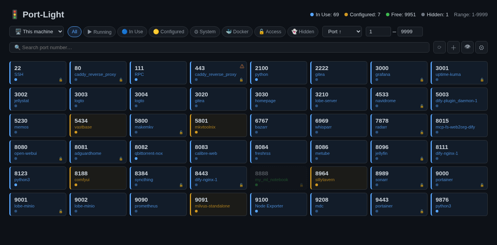

# Port-Light

A web dashboard that shows your server's port usage as a traffic-light grid. Built for homelabbers who run many Docker Compose stacks and keep forgetting which port is taken.



## What it does

Port-Light merges three data sources and shows you a single grid:

- **`ss -tlnp`** — which ports are actually listening, and which process owns them
- **Docker API** — container names, status, image, port mappings
- **docker-compose files** — ports that *should* be in use, even if the container isn't running

The result: every port gets one of three states.

| Color | State | Meaning |
|-------|-------|---------|
| 🔵 Blue | In Use | Something is listening on this port |
| 🟡 Amber | Configured | Declared in a compose file or manually added, but nothing is running |
| 🟢 Green | Free | Nothing is using it |

## Features

- **Container names on cards** — see what's running without clicking
- **Smart port search** — search for a port number; if it's taken, you get the surrounding free ports as alternatives
- **Multi-select filters** — filter by Running, In Use, Configured, System, Docker, Access, Hidden
- **Sort** — by port number (asc/desc), name (A-Z/Z-A), or status
- **Port range** — narrow the view to a specific range
- **Manual ports** — add ports that are in use but not detected by scanning
- **Hidden ports** — password-protect sensitive ports from being shown
- **Access port classification** — standard services are tagged as access (SSH, web UIs) or internal (databases, exporters)
- **Conflict detection** — warns when the same port appears in multiple compose files
- **Multi-machine support** — track ports across machines on your LAN
- **Auto-refresh** — 5 second polling, toggleable
- **Zero dependencies on the frontend** — vanilla HTML/CSS/JS, no npm, no build step

## Quick start

```bash
git clone https://github.com/StepaniaH/port-light.git
cd port-light
cp .env.example .env  # point COMPOSE_SCAN_DIR at your compose stacks
docker compose up -d
```

Open `http://localhost:2100`.

If you'd rather use the prebuilt image from Docker Hub:

```bash
docker run -d \
  --name port-light \
  --cap-add NET_ADMIN \
  -v /var/run/docker.sock:/var/run/docker.sock:ro \
  -v /proc:/host/proc:ro \
  -v ~/your-compose-dir:/compose:ro \
  -v port-light-data:/data \
  -p 2100:2100 \
  stepaniah/port-light:latest
```

## How it works

```
┌─────────────────────────────────────────────┐
│  ss -tlnp  ──┐                               │
│              ├──→  merge  ──→  classify      │
│  Docker API ─┤    (FastAPI)    (used/cfg/free)│
│              ├──→           ──→  JSON API    │
│  compose.yml┘                    ──→  Web UI │
└─────────────────────────────────────────────┘
```

| Source | Method | Provides |
|--------|--------|----------|
| Host network | `ss -tlnpH` | Listening ports + process names |
| Docker | `/var/run/docker.sock` | Container names, status, images, port bindings |
| Compose files | Scans `COMPOSE_SCAN_DIR` for `docker-compose.y*ml` | Expected port mappings (even when stopped) |

### How does port scanning work in a container?

Port-Light reads the host's `/proc/net/tcp` and `/proc/net/tcp6` directly from the `/host/proc` mount. This works in a standard bridge container without root, `pid: host`, or `nsenter` — it's just reading files. The trade-off is that process names aren't available this way (only port numbers and IPs), but Port-Light cross-references with the Docker API to fill in container names.

`cap_add: NET_ADMIN` is kept as a fallback for bare-metal deployments where `ss -tlnpH` can provide process names directly.

## Configuration

All config via environment variables or `.env` file:

| Variable | Default | Description |
|----------|---------|-------------|
| `COMPOSE_SCAN_DIR` | `/compose` | Directory to scan for compose files |
| `PORT_RANGE_START` | `1` | Start of range for free port count |
| `PORT_RANGE_END` | `9999` | End of range for free port count |
| `PORT_LIGHT_DATA_DIR` | `/data` | Where manual/hidden port data is stored |
| `CUSTOM_PORTS_FILE` | `/data/custom_ports.json` | User-specific port definitions |

### Custom port definitions

The built-in database covers ~90 standard ports (SSH, HTTP, PostgreSQL, Jellyfin, etc.). For your own non-standard ports, create a `custom_ports.json`:

```json
{
  "3001": {"name": "Grafana", "description": "Grafana dashboard", "category": "selfhosted", "is_access_port": true}
}
```

See `custom_ports.example.json` for the full format. This file is gitignored — it stays on your machine.

Categories: `system`, `web`, `database`, `message`, `proxy`, `vpn`, `selfhosted`, `dev`, `infra`, `gaming`.

## Privacy

- No telemetry, no analytics, no external calls
- All data stays on your server
- No login or authentication — designed for LAN use behind a reverse proxy
- Docker socket and `/proc` mounted read-only
- User data (manual ports, hidden ports, machines) stored in a local JSON file, never transmitted

## Tech stack

- **Backend:** Python, FastAPI, Uvicorn
- **Frontend:** Vanilla HTML/CSS/JS (no framework, no build step)
- **Image:** `python:3.12-slim` + `iproute2`

## License

MIT
