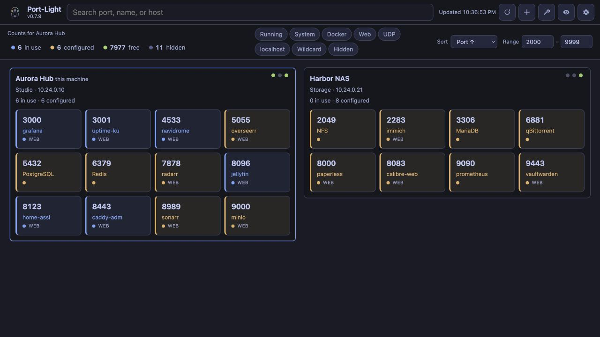

<p align="center">
  
</p>

# Port-Light

自托管的主机端口占用看板，将主机监听、Docker 映射和 Compose 声明合并为红绿灯网格。

[](LICENSE)
[](https://hub.docker.com/r/stepaniah/port-light)
[](https://hub.docker.com/r/stepaniah/port-light)
[](https://github.com/StepaniaH/port-light/tags)

[English](README.md) · [简体中文](README.zh-CN.md)

<p align="center">
  
</p>

## 它做什么

把三条**本机**数据合成一张网格：

| 来源 | 你能看到什么 |
|------|----------------|
| 主机监听表（`/proc` 或 `ss`） | 实际绑定的 TCP/UDP 端口 |
| Docker API | 容器名、状态、镜像、发布的端口映射 |
| Compose 文件 | **声明了**但栈可能没在跑的端口 |

| 颜色 | 状态 | 含义 |
|------|------|------|
| 蓝 | 占用 | 有进程在听，或有容器带着这个映射在跑 |
| 黄 | 已配置 | Compose 里声明了（或手动添加了），但当前没人听 |
| 绿 | 空闲 | **搜索某个端口号时**才会出现，并带上附近可用端口作备选 |

默认网格只画**已被占用或已声明**的端口，不会把 1–9999 全涂成绿色。

这是**端口占用图**，不是容器管理器。它不会启停容器、看日志，也不替代 Portainer。

## 功能

- 卡片上直接显示容器 / 服务名
- 按端口号搜索；已被占用时给出附近空闲端口
- 占用数字可筛选占用 / 已配置；类型芯片：运行中、系统、Docker、网页、UDP、localhost、通配地址、隐藏
- 按端口、名称、状态排序；可限制显示区间
- 扫描不到的端口可以手动登记
- 两个 Compose 项目在重叠的绑定地址上声明同一主机端口时标冲突
- 常见 homelab 端口内置名称（SSH、Jellyfin、Postgres 等），可用本地文件覆盖
- 可调自动刷新（设置中提供 5 秒至 5 分钟选项），并按所选间隔提示建议的其他机器容量
- 点击复制端口号
- 可选的卡片绑定地址摘要，可分别控制 IPv4/IPv6、紧凑显示 IPv6，并省略重复的通配绑定
- 一个界面可以拉取最多 32 个其他 Port-Light 实例的占用图（局域网 / Tailscale）。默认以瀑布流展示全部机器，也可在「设置 → 外观 → 卡片」中选择分 Tab；机器名称下方可填写 IP 等简短备注。每台机器仍自己扫描。
- 设置修改后会自动保存。外观仍会实时预览：深色 / 浅色 / 跟随系统，以及 Gruvbox、Catppuccin、Nord 等 10 套配色，每套都支持深色和浅色；界面语言（English / Français / Deutsch / Español / 简体中文 / 繁體中文 / 日本語）：设置页可改，也可以写在 Compose 环境变量里
- 自定义色板、JSON 导入导出，以及宽松 / 标准 / 紧凑三种卡片密度
- Setup / Doctor 检查设置存储、快照新鲜度、本机监听来源可信度、Docker 访问、Compose 发现完整性和近期降级事件；复制或下载的报告不包含机器名称、URL、端口、路径、凭据、环境变量值或事件范围
- 可选 HTTP Basic Auth（`AUTH_USER` / `AUTH_PASSWORD`）
- 支持用标签给端口命名：`port-light.port.<端口>.name` / `.category`
- 查找空闲端口：工具栏按钮（或 `GET /api/free-runs?count=N`）返回范围内最大的连续空闲段，可一键预留
- 自动化 API：`GET /api/ports/suggest` 返回最近一次扫描中可用的端口，支持预留或到期释放的租约；同时提供 MCP stdio 服务器和智能体集成
- 本地历史：端口状态变化写入数据卷内的 `history.db`（默认保留 7 天，`HISTORY_RETENTION_DAYS=0` 关闭）；详情抽屉显示最近变动，也可用 `GET /api/ports/{n}/history`
- 可选 Webhook：设置 `WEBHOOK_URL` 与 `WEBHOOK_EVENTS=new_listener,conflict` 后，端口开始被占用或两个栈冲突时 POST JSON 通知
- 后台扫描：无需打开浏览器即可更新历史和 webhook；界面通过 `GET /api/events`（SSE）接收占用变化，并保留 ETag 轮询以处理重连和其他主机
- TCP 和 UDP；绑定范围（`0.0.0.0` / localhost / 局域网）
- 前端使用原生 HTML/CSS/JS（native ES modules），生产运行不需要构建步骤

### 已知限制（部署前请读）

- **局域网工具。** 未设置 `AUTH_USER` / `AUTH_PASSWORD` 时没有登录。请放在反向代理后面，或不要暴露到公网。见 [SECURITY.md](SECURITY.md)。
- **从网格隐藏**只是显示过滤。只有配置了 `AUTH_*` 或 `HIDDEN_UNLOCK_PASSWORD` 时，API 才会真正不返回这些端口。
- **多机是只读汇总。** 每台机器仍各自跑 Port-Light。一个界面可以通过局域网或 Tailscale 拉取最多 32 台其他机器的占用图（设置 → 占用图）。刷新控件会按当前间隔提示建议容量；即使超过建议值，内部请求仍会限流。不要把 2100 端口暴露到公网。由 Hub 自己去拉这些地址；Docker 桥接容器常常连不上 Tailscale 的 `100.x` — 改填局域网 IP，或让 Hub 使用 `network_mode: host`。
- 挂了 `/host/proc` 时（镜像默认如此），监听端口可以从 inode 对上进程名。没挂则只能看到 Docker 的容器名。`ss -tlnp` 的进程名仍需要 host network 或裸机。
- `network_mode: host` 的容器在挂了 `/host/proc` 时通过 socket inode 关联；否则回退到 `ExposedPorts`。

后续计划与架构：[docs/roadmap.md](docs/roadmap.md)、[docs/architecture.md](docs/architecture.md)。API 与 MCP 集成：[docs/integrations.md](docs/integrations.md)。

升级后若仍出现占用警告，可将鼠标移至信息图标，或聚焦、点击警告查看对应扫描器的排查建议。镜像升级不能自动处理的权限与配置问题，见 [升级与故障排查（英文）](docs/troubleshooting.md#occupancy-scan-warning)。

## 快速开始

镜像：[`stepaniah/port-light`](https://hub.docker.com/r/stepaniah/port-light)（`linux/amd64`、`linux/arm64`）。打 tag 发布时也会推到 GHCR（`ghcr.io/stepaniah/port-light`）。重要机器请钉版本标签，不要长期用 `latest`。

```yaml
services:
  port-light:
    image: stepaniah/port-light:v0.8.0
    container_name: port-light
    restart: unless-stopped
    ports:
      - "2100:2100"
    volumes:
      - /path/to/your/compose-stacks:/compose:ro
      - /var/run/docker.sock:/var/run/docker.sock:ro
      - /proc:/host/proc:ro
      - ./data:/data
    environment:
      COMPOSE_SCAN_DIR: /compose
```

```bash
mkdir -p data
docker compose up -d
```

打开 `http://localhost:2100`。

挂载 `/var/run/docker.sock` 会授予广泛的 Docker API 访问权限；只读挂载不会限制 API 操作。如果 UI 可能被不完全信任的人访问，请用 [socket proxy](docs/deployment.md#docker-socket-proxy)。更多安装方式（Unraid 模板、Podman、反向代理、从源码构建）见 [docs/deployment.md](docs/deployment.md)。

常规桥接网络**不需要** `NET_ADMIN`。它只对裸机上的 `ss` 回退路径有帮助。

扫描来源默认全部启用。任一启用来源失败、Compose 扫描不完整或快照过期时，端口图会显示警告，无法确认的端口显示为未知，查找空闲端口和批量预留返回 `503`。不使用 Docker 的本机部署可设置 `PORT_LIGHT_SCANNERS=listen,compose`；仅扫描监听端口可设为 `listen`。禁用来源中的占用不会参与检查。

## 配置

| 变量 | 默认 | 说明 |
|------|------|------|
| `PORT_LIGHT_SCANNERS` | `listen,docker,compose` | 启用的扫描来源，逗号分隔；未列出的来源明确禁用。至少选择一项。也可在设置 → 占用图中修改。 |
| `PORT_LIGHT_SCAN_TIMEOUT_S` | `10` | 后台刷新超时秒数（1–60），超时后保留快照并标记过期。只能用环境变量。 |
| `COMPOSE_SCAN_DIR` | `/compose` | 扫描 compose 文件的目录（只能用环境变量） |
| `COMPOSE_SCAN_DEPTH` | `4` | 扫描子目录的最大深度 |
| `COMPOSE_SCAN_EXCLUDE_DIRS` | 未设置 | 自动发现时跳过的目录名，逗号分隔；Compose 中显式 `include` / `extends` 的文件仍会读取。 |
| `COMPOSE_SCAN_MAX_FILES` | `400` | 每次刷新最多解析的 compose 文件数 |
| `PORT_RANGE_START` | `1` | **空闲数量**统计的起始端口 |
| `PORT_RANGE_END` | `9999` | 上述区间的结束（不会把网格填满绿格） |
| `PORT_LIGHT_DATA_DIR` | `/data` | 手动端口、隐藏列表、已保存设置（JSON） |
| `PORT_LIGHT_PORT` | `2100` | uvicorn 在容器内监听的端口；经 `/api/meta` 暴露，自动化面板据此生成 MCP 片段，不再写死 |
| `CUSTOM_PORTS_FILE` | `/data/custom_ports.json` | 额外 / 覆盖的端口名称（只能用环境变量） |
| `THEME_MODE` | `system` | `system` / `dark` / `light`，解析后的明暗；配色跟随明暗 |
| `THEME_PALETTE` | 内置 | 叠在明暗之上的配色族：`gruvbox`、`catppuccin`、`solarized`、`nord`、`dracula`、`tokyo-night`、`one-dark`、`everforest`、`rose-pine`、`kanagawa`。留空使用内置颜色。 |
| `LOCALE` | `auto` | `auto` / `en` / `fr` / `de` / `es` / `zh-CN` / `zh-TW` / `ja`。`auto` 跟随浏览器。 |
| `GRID_DENSITY` | `standard` | 卡片密度预设：`loose`(宽松)、`standard`(标准)、`compact`(紧凑)。旧值 `comfortable` 视同 `standard`。 |
| `SHOW_BIND_ADDRESSES` | `false` | 在已占用卡片上显示紧凑的绑定地址摘要。 |
| `SHOW_BIND_IPV4` | `true` | 开启卡片绑定地址摘要时包含 IPv4 地址。 |
| `SHOW_BIND_IPV6` | `true` | 开启卡片绑定地址摘要时包含 IPv6 地址。 |
| `REFRESH_MS` | `5000` | 看板轮询间隔（1,000–300,000 毫秒）。设置页提供 5 秒至 5 分钟选项，并提示建议的其他机器容量；本机后台扫描间隔仍不超过 30 秒。 |
| `PORT_LIGHT_HOST_LAYOUT` | `waterfall` | 默认以响应式瀑布流展示全部机器；`tabs` 为逐台切换。桌面和移动端均遵循此选择。 |
| `URL_HOST` | 空 | 猜测链接里用的主机名 |
| `URL_SCHEME` | `auto` | `auto` / `http` / `https` |
| `AUTH_USER` / `AUTH_PASSWORD` | 未设置 | 可选 HTTP Basic Auth。`/api/health` 保持开放。只能用环境变量。 |
| `HIDDEN_UNLOCK_PASSWORD` | 未设置 | 设置后（或启用了 Basic Auth），从网格隐藏的端口不会出现在未解锁的 API 里。只能用环境变量。 |
| `PORT_LIGHT_SETTINGS_SOURCE` | `auto` | `auto`：设置页的值覆盖 env 默认值。`env`：只认 Compose，设置页只读。 |
| `PORT_LIGHT_HOST_NAME` | 主机名 | 多机器视图中本机占用图的名称。也可在设置 → 占用图中修改。 |
| `PORT_LIGHT_HOST_DESCRIPTION` | 空 | 多机器视图中本机名称下方的可选纯文本短描述，最多 120 字。 |
| `PORT_LIGHT_PEERS` | 未设置 | 最多 32 个 `{name, url, description?, username?, password?}` 条目的 JSON 数组。短描述为可选纯文本，最多 120 字。数据文件没有 `peers` 键时使用，或 `PORT_LIGHT_SETTINGS_SOURCE=env` 时使用。与设置页同一把锁。 |
| `PORT_LIGHT_LOG_LEVEL` | `warning` | 后端日志级别（`debug` / `info` / `warning` / `error`）。扫描器降级（Docker 不可达、Compose 文件解析失败等）会记一条日志，并出现在 `/api/health` 的 `degradations` 里。只能用环境变量。 |
| `WEBHOOK_URL` | 未设置 | 可选 webhook 目标（仅 http/https）。配合 `WEBHOOK_EVENTS=new_listener,conflict`，在端口开始占用或发生冲突时以 fire-and-forget 方式 POST `{event, port}`。 |
| `WEBHOOK_SECRET` | 未设置 | 以 `X-Port-Light-Secret` 头发送。 |
| `WEBHOOK_EVENTS` | 未设置 | 逗号分隔：`new_listener`、`conflict`。 |
| `METRICS_ENABLED` | 未设置 | 设为 `1` 后开放 `GET /api/metrics`（Prometheus 文本格式：占用/已配置/空闲数量、隐藏数、降级数、Compose 文件数）。只输出聚合值，不含端口与名称。只能用环境变量。 |
| `AGENT_TOKEN` | 未设置 | 设置后，`GET /api/ports/suggest` 需要匹配的 `X-Agent-Token` 头。只能用环境变量。 |

上表里除超时、路径和密钥外，也可以在 Web UI 的**设置**中修改，包括本机名称、扫描来源、Compose 发现范围和其他机器。修改会自动写入 `/data/port_light.json`；请求只提交实际改动的字段，也可以移除已保存的覆盖值，恢复继承环境变量或默认值。OpenAPI 在 `/docs`。

状态栏会显示待保存、已保存或保存失败。离开页面前，请补全每台机器的名称和 URL。创建、导入或删除自定义色板仍需在色板编辑器中手动操作。

把 [custom_ports.example.json](custom_ports.example.json) 复制为 `custom_ports.json`（已 gitignore）。分类：`system`、`web`、`database`、`message`、`proxy`、`vpn`、`selfhosted`、`dev`、`infra`、`gaming`。

如果在 Compose 里 bind-mount `custom_ports.json`，请先在宿主机上建好**文件**。路径不存在时 Docker 会建成目录，应用就读不了。

已有的 `port_light.json` 如果不可读、JSON 损坏或记录结构无效，相关 API 会返回 `503` 并保留原文件，修复后可重试；只有文件不存在时才按空配置初始化。

## 隐私

- 无遥测、无统计。
- 除非配置了其他 Port-Light 实例或 webhook，否则应用不会发送出站 HTTP 请求。Webhook 只发送 `{event, port}`。
- 扫描数据存储在本机，并提供给页面和 API 客户端；Hub 会接收已配置实例返回的占用数据。启用身份验证可限制读取权限。
- API 和端口详情原本就包含绑定地址；开启卡片摘要后，截图会更容易包含这些地址，分享前请检查截图内容。
- 机器短描述是纯文本，拥有页面或 API 访问权限的人均可读取，也可能出现在截图中。请勿填写密码、令牌或其他秘密信息。
- Doctor 报告由聚合数据白名单生成，只包含状态、数量、安全的来源枚举和已知失败原因；不包含机器身份、其他机器详情、绑定地址、端口、文件路径、环境变量值、凭据或降级事件范围。未知来源和原因会被替换为 `unknown` / `redacted`。
- Compose 旁边的 `.env` 只用于本地 `${VAR}` 替换，不会上传。
- 手动标签、端口历史、自动化调用标签和 peer 设置都保存在数据卷中。peer 密码保存在 `port_light.json`；应像保护其他凭据文件一样保护该数据卷。

## 技术栈

- 后端：Python 3.11+（CI 覆盖 3.11–3.13）、FastAPI、Uvicorn
- 前端：静态 HTML/CSS/JS
- 镜像：`python:3.12-slim` + `iproute2`

## 许可证

[MIT](LICENSE) © 2026 StepaniaH

[Changelog](CHANGELOG.md) · [Security](SECURITY.md) · [Contributing](CONTRIBUTING.md) · [Ko-fi](https://ko-fi.com/stepaniah)
